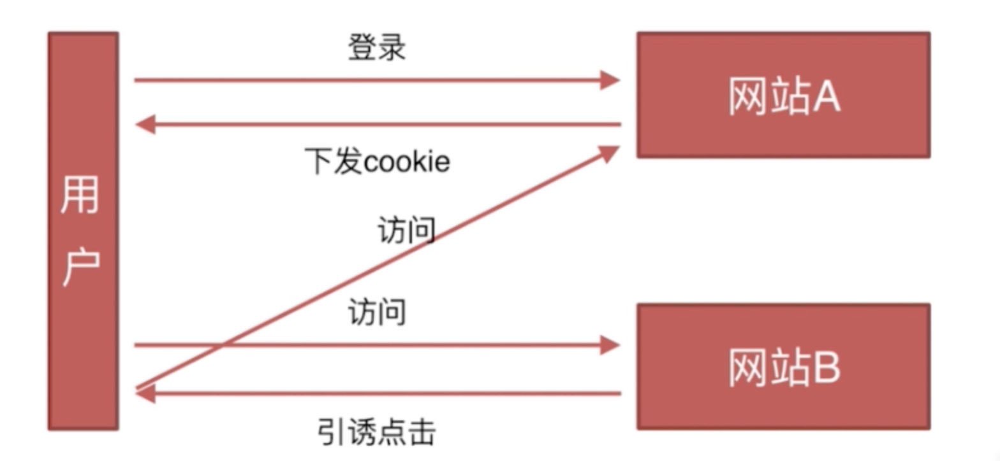

### 浏览器相关

#### 跨域，为什么JS会对跨域做出限制

浏览器的同源策略会导致跨域，这里同源策略又分为以下两种

- DOM同源策略：禁止对不同源页面DOM进行操作。这里主要场景是iframe跨域的情况，不同域名的iframe是限制互相访问的。

- XmlHttpRequest同源策略：禁止使用XHR对象向不同源的服务器地址发起HTTP请求。

> 只要协议、域名、端口有任何一个不同，都被当作是不同的域，之间的请求就是跨域操作。

解决跨域方案：

[前端常见跨域解决方案（全）](https://segmentfault.com/a/1190000011145364)

- 跨域资源共享 CORS

- JSONP

- 服务器代理

- document.domain来跨子域

- window.name

- location.hash跨域

- 使用postMessage实现页面之间通信

#### 前端安全：XSS，CSRF

XSS（cross-site scripting跨域脚本攻击），参考文档[前端安全之XSS攻击](https://www.cnblogs.com/lovesong/p/5199623.html)

- Reflected XSS（基于反射的XSS攻击）

安全措施：
1、前端在显示服务端数据时候，不仅是标签内容需要过滤、转义，就连属性值也都可能需要。
2、后端接收请求时，验证请求是否为攻击请求，攻击则屏蔽。

- Stored XSS（基于存储的XSS攻击）

安全措施：
1、首要是服务端要进行过滤，因为前端的校验可以被绕过。
2、当服务端不校验时候，前端要以各种方式过滤里面可能的恶意脚本，例如script标签，将特殊字符转换成HTML编码。

- DOM-based or local XSS（基于DOM或本地的XSS攻击）

安全措施：使用HTTPS

CSRF 跨站点请求伪造（Cross—Site Request Forgery），参考文档[CSRF攻击与防御](https://www.cnblogs.com/phpstudy2015-6/p/6771239.html)



目前防御CSRF攻击主要有三种策略：验证 HTTP Referer 字段；在请求地址中添加 token 并验证；在 HTTP 头中自定义属性并验证。

#### 浏览器怎么加载页面的？script脚本阻塞有什么解决方法？defer和async的区别？

- 浏览器怎么加载页面的

浏览器在代码中发现一个img标签引用了一张图片，向服务器发出请求。此时浏览器不会等到图片下载完，而是继续渲染后面的代码，服务器返回图片文件，由于图片占用了一定面积，影响了后面段落的排布，因此浏览器需要回过头来重新渲染这部分代码

1、浏览器下载的顺序是从上到下，渲染的顺序也是从上到下，下载和渲染是同时进行的。
2、在渲染到页面的某一部分时，其上面的所有部分都已经下载完成（并不是说所有相关联的元素都已经下载完）。
3、如果遇到语义解释性的标签嵌入文件（JS脚本，CSS样式），那么此时IE的下载过程会启用单独连接进行下载。
4、并且在下载后进行解析，解析过程中，停止页面所有往下元素的下载。
5、样式表在下载完成后，将和以前下载的所有样式表一起进行解析，解析完成后，将对此前所有元素（含以前已经渲染的）重新进行渲染。
6、JS、CSS中如有重定义，后定义函数将覆盖前定义函数。

- script脚本阻塞有什么解决方法

1、定义的defer属性和async属性的
2、放到body底部

- defer和async的区别

defer：当浏览器遇到 script 标签时，文档的解析不会停止，其他线程将下载脚本，待到文档解析完成，脚本才会执行。
async：当浏览器遇到 script 标签时，文档的解析不会停止，其他线程将下载脚本，脚本下载完成后开始执行脚本，脚本执行的过程中文档将停止解析，直到脚本执行完毕。

#### 浏览器强缓存和协商缓存

- 强缓存

强缓存是利用http头中的Expires和Cache-Control两个字段来控制的，用来表示资源的缓存时间。强缓存中，普通刷新会忽略它，但不会清除它，需要强制刷新。浏览器强制刷新，请求会带上Cache-Control:no-cache和Pragma:no-cache

- 协商缓存

协商缓存就是由服务器来确定缓存资源是否可用，所以客户端与服务器端要通过某种标识来进行通信，从而让服务器判断请求资源是否可以缓存访问。这个主要涉及到两组header字段：Etag和If-None-Match、Last-Modified和If-Modified-Since。
Last-Modified与ETag是可以一起使用的，服务器会优先验证ETag，一致的情况下，才会继续比对Last-Modified，最后才决定是否返回304。

请参考[HTTP强缓存和协商缓存](https://segmentfault.com/a/1190000008956069)

#### 浏览器的全局变量有哪些

document
location
history

#### 浏览器同一时间能够从一个域名下载多少资源

HTTP/1.1


HTTP/2(SPDY)

> Multiplexed support(one single TCP connection for all requests)

#### 按需加载，不同页面的元素判断标准

按需加载：指的是当用户触发了动作时才加载对应的功能

html,img,js等

参考文档：[按需加载](http://www.cnblogs.com/oltra/p/5582903.html)

#### web存储、cookies、localstroge等的使用和区别

WebStorage(localStorage/sessionStorage)官方建议为每个网站5MB

- localStorage

同源的文档间共享相同的localStorage数据。它们之间可以互相读取甚至覆盖对方数据。非同源的文档间互相都不能读取或覆盖对方的数据（即使运行的脚本是来自同一台第三方服务器也不行）。

- sessionStorage

限定在窗口中。如果同源的文档渲染在不同的浏览器标签页中，那么它们的数据也无法共享。一个标签页中的脚本是无法读取或覆盖由另一个标签页脚本写入的数据。

- cookie

HTTP cookie的缺点很明显，最多只能存储4KB的数据，每个HTTP请求都会被传送回服务器，明文传输

#### 浏览器的内核

参考文档[主流浏览器内核介绍（前端开发值得了解的浏览器内核历史）](http://web.jobbole.com/84826/)

浏览器内核：渲染引擎、JS引擎，后来JS引擎越来越独立，内核就倾向于只指渲染引擎。常见的浏览器内核可以分这四种：Trident、Gecko、Blink、Webkit。

- Trident ([‘traɪd(ə)nt])

也被普遍称作“IE内核”。
IE从版本11开始，初步支持WebGL技术。IE8的JavaScript引擎是Jscript，IE9开始用Chakra，这两个版本区别很大，Chakra无论是速度和标准化方面都很出色。
代表作品还有腾讯、Maxthon（遨游）、360浏览器等

- Gecko ([‘gekəʊ])

代表作品是Firefox
它是开源的，最大优势是跨平台，在Microsoft Windows、Linux、MacOs X等主要操作系统中使用

- Webkit

代表作品是Safari、曾经的Chrome，是开源的项目

- Chromium/Blink

现在Chrome内核是Blink。谷歌还开发了自己的JS引擎V8，使JS运行速度极大地提高了

- Presto ([‘prestəʊ])

代表作品是Opera，在13年之后，Opera宣布加入谷歌阵营，弃用了Presto 

- 关于移动端

目前移动设备浏览器上常用的内核有 Webkit，Blink，Trident，Gecko 等，其中 iPhone 和 iPad 等苹果 iOS 平台主要是 WebKit，Android 4.4 之前的 Android 系统浏览器内核是 WebKit，Android4.4 系统浏览器切换到了Chromium，内核是 Webkit 的分支 Blink，Windows Phone 8 系统浏览器内核是 Trident。

说明：Webkit其实是KHTML的分支，这里的KHTML指渲染引擎，Webkit其实就泛指了Webkit的渲染引擎WebCore，而Webkit引擎的Javascript引擎JSCore则是KJS的分支。而chrome则搭载了自己的Javascript引擎V8

#### 如何实现缓存机制？

前端缓存实现：
1、浏览器缓存
2、CDN缓存
3、H5中的离线缓存（manifest）
4、本地存储（localStorage、sessionStorage）

#### 说一下200和304的理解和区别

304(Not Modified)：与server有交互

200(From cache)：没有跟server做交互，直接拉的本地缓存。

#### 什么是预加载、懒加载

[懒加载和预加载的实现](https://www.cnblogs.com/Cathamerst/p/7445715.html)
[懒加载和预加载](https://www.jianshu.com/p/4876a4fe7731)

- 预加载

1.图片等静态资源在使用之前的提前请求；
2.资源后续使用时可以从缓存中加载，提升用户体验；
3.页面展示的依赖关系维护（必需的资源加载完才可以展示页面，防止白屏等）；

实现方式：
1.html中img标签最初设置为display:none；
2.js脚本中使用image对象动态创建好图片；
3.使用XMLHttpRequest对象可以更加精细的控制预加载过程，缺点是无法跨域。

- 懒加载

1.图片进入可视区域之后请求图片资源；
2.对于电商等图片较多，页面很长的业务场景很适用；
3.可以减少无效资源的加载；
4.并发加载的资源过多会阻塞js的加载，影响网站的正常使用；

#### 一个XMLHttpRequest实例有多少种状态？

XMLHttpRequest对象生命周期：创建－初始化请求－发送请求－接收数据－解析数据－完成

readyState：
0 － （未初始化）还没有调用send()方法
1 － （载入）已调用send()方法，正在发送请求
2 － （载入完成）send()方法执行完成，已经接收到全部响应内容
3 － （交互）正在解析响应内容
4 － （完成）响应内容解析完成，可以在客户端调用了

status：状态码
1xx——信息类，表示收到Web浏览器请求，正在进一步的处理中。如，100：客户必须继续发出请求；101：客户要求服务器根据请求转换HTTP协议版本
2xx——成功，表示用户请求被正确接收，理解和处理。例如，200：OK；201：提示知道新文件的URL
3xx——重定向，表示请求没有成功，客户必须采取进一步的动作。如，300：请求的资源可在多处得到；301：删除请求数据
4xx——客户端错误，表示客户端提交的请求有错误。如，404：NOT Found，意味着请求中所引用的文档不存在
5xx——服务器错误，表示服务器不能完成对请求的处理。如，500，服务器产生内部错误

#### dns解析原理，输入网址后如何查找服务器

参考文档：
[DNS 原理入门](http://www.ruanyifeng.com/blog/2016/06/dns.html)
[DNS解析过程详解](http://blog.chinaunix.net/uid-28216282-id-3757849.html)

#### 服务器如何知道你？

1、userAgent判断请求环境
2、Cookie识别用户身份
3、HTTPS防篡改

#### 浏览器渲染过程


1、处理HTML标记并构建DOM树。
2、处理CSS标记并构建CSSOM树。
3、将DOM与CSSOM合并成一个渲染树。
4、根据渲染树来布局，以计算每个节点的几何信息。
5、将各个节点绘制到屏幕上。

[浏览器渲染页面过程与页面优化](https://segmentfault.com/a/1190000010298038)

#### IE的某些兼容性问题

问题思路，可以列举html、css、js各代表

参考文档：[Web前端页面的浏览器兼容性测试心得（三）总结一些IE8兼容问题的解决方案](https://www.cnblogs.com/zamhown/p/6709932.html)

- html部分

1、IE8不支持placeholder

2、H5新标签在IE9以下的浏览器识别 

```javascript
<!--[if lt IE 9]>
 <script type="text/javascript" src="js/html5shiv.js"></script>
<![endif]-->
// https://github.com/aFarkas/html5shiv/releases
```
ul标签内外边距问题ul标签在IE6\IE7中，有个默认的外边距，但是在IE8以上及其他浏览器中有个默认的内边距。解决方法：统一设置ul的内外边距为0

- CSS样式的兼容性

1、IE8不支持CSS媒体查询

2、CSS3引入了新的字体大小单位rem，与em的“相对于其父元素来设置字体大小”的功能不同，rem是相对于根元素html的字体大小比率单位，成了目前主流的单位之一。IE9+开始支持，IE8就只能通过引入js库来支持了。

- JS

1、标准的事件绑定方法函数为addEventListener，但IE下是attachEvent

2、事件的捕获方式不一致，标准浏览器是由外至内，而IE是由内到外，但是最后的结果是将IE的标准定为标准

3、window.event获取的。并且获取目标元素的方法也不同，标准浏览器是event.target，而IE下是event.srcElement

4、获得DOM节点的父节点、子节点的方式不同
    其他浏览器：parentNode  parentNode.childNodes
    IE：parentElement parentElement.children

5、IE8的数组对象没有forEach方法

#### Session和Cookie

[理解Cookie和Session机制](https://www.cnblogs.com/andy-zhou/p/5360107.html)

#### 拖拽实现

[JavaScript实现最简单的拖拽效果](http://www.zhangxinxu.com/wordpress/2010/03/javascript%E5%AE%9E%E7%8E%B0%E6%9C%80%E7%AE%80%E5%8D%95%E7%9A%84%E6%8B%96%E6%8B%BD%E6%95%88%E6%9E%9C/)

#### 拆解url的各部分（正则）

`scheme://host:port/path?query#fragment`

（1）scheme:通信协议，常用的http,ftp,maito等。
（2）host:主机，服务器(计算机)域名系统 (DNS) 主机名或 IP 地址。
（3）port:端口号，整数，可选，省略时使用方案的默认端口，如http的默认端口为80。
（4）path:路径，由零或多个"/"符号隔开的字符串，一般用来表示主机上的一个目录或文件地址。
（5）query:查询，可选，用于给动态网页（如使用CGI、ISAPI、PHP/JSP/ASP/ASP.NET等技术制作的网页）传递参数，可有多个参数，用"&"符号隔开，每个参数的名和值用"="符号隔开。
（6）fragment:信息片断，字符串，用于指定网络资源中的片断。例如一个网页中有多个名词解释，可使用fragment直接定位到某一名词解释。(也称为锚点)

- 正则拆解URL

```javascript
function parseUrl(url) {
    var result = {};
    var keys = ['href', 'origin', 'protocol', 'host',
                'hostname', 'port', 'pathname', 'search', 'hash'];
    var i, len;
    var regexp = /(([^:]+:)\/\/(([^:\/\?#]+)(:\d+)?))(\/[^?#]*)?(\?[^#]*)?(#.*)?/;

    var match = regexp.exec(url);

    if (match) {
        for (i = keys.length - 1; i >= 0; --i) {
            result[keys[i]] = match[i] ? match[i] : '';
        }
    }
    return result;
}
```


