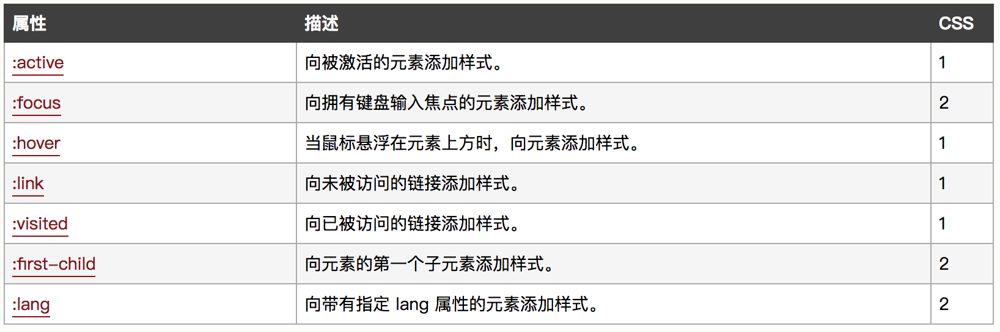
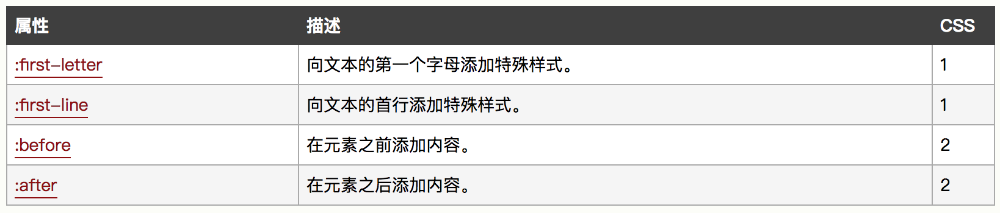
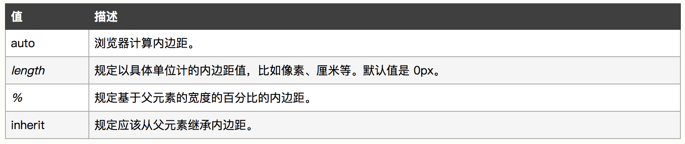

### CSS

#### 盒模型


`box-sizing: content-box;`


`box-sizing: border-box;`

#### CSS新特性，伪类，伪元素，锚伪类

- CSS新特性

1、CSS3实现圆角（border-radius），阴影（box-shadow）

2、对文字加特效（text-shadow、），线性渐变（gradient），旋转（transform）

3、transform:rotate(9deg) scale(0.85,0.90) translate(0px,-30px) skew(-9deg,0deg);// 旋转,缩放,定位,倾斜

4、增加了更多的CSS选择器  多背景 rgba 

5、在CSS3中唯一引入的伪元素是 ::selection 匹配被用户选取的选取是部分。

6、媒体查询，多栏布局

7、border-image

- 伪类



- 伪元素



CSS3新增::selection

- 锚伪类

`a:link { color: #ff00ff; }` 表示未访问的链接

`a:visited { color: #00ff00; }` 表示已访问的链接

`a:hover { color: #ff00ff; }` 鼠标移动到链接上的情况

`a:active { color: #0000ff; }` 表示选定的链接

#### CSS实现隐藏页面的方式

- Opacity

```css
.hide {
  opacity: 0;
}
```

- Display

```css
.hide {
   display: none;
} 
```

- Visibility

```css
.hide {
   visibility: hidden;
} 
```

- Clip-path

```css
.hide {
  clip-path: polygon(0px 0px,0px 0px,0px 0px,0px 0px);
}
```

- Position

```css
.hide {
   position: absolute;
   top: -9999px;
   left: -9999px;
}
```

[用css隐藏元素的5种方法](https://www.cnblogs.com/cythia/p/5981306.html)

#### 如何实现水平居中和垂直居中

参考：

[六种实现元素水平居中](https://www.w3cplus.com/css/elements-horizontally-center-with-css.html)

[用 CSS 实现元素垂直居中，有哪些好的方案？](https://www.zhihu.com/question/20543196)

#### 说说position，display

[CSS布局 ——从display，position， float属性谈起](https://www.cnblogs.com/dolphinX/archive/2012/10/13/2722501.html)

[display与position之间的关系](https://www.cnblogs.com/baimiaolei/p/5627755.html)

#### 请解释*{box-sizing: border-box;}的作用，并说明使用它的好处

使用IE盒模型。当设置box-sizing:border-box以后，我们想要一个宽度为200px的盒子，那么我们直接设置宽度为200px。

#### 浮动元素引起的问题和解决办法？绝对定位和相对定位，元素浮动后的display值

- 特征

1、浮动元素会脱离正常的文档流，按照其外边距指定的位置相对于它的上一个块级元素（或父元素）显示
2、浮动元素后面的块级元素的内容会向此浮动元素的外边距靠齐，但是边框和背景却忽略浮动元素而向上一个任意非浮动元素靠齐
3、浮动元素后面的内联元素会向此浮动元素的外边距靠齐

- 影响

1、对于其父元素来说，元素浮动之后，它脱离当前正常的文档流，所以它也无法撑开其父元素，造成父元素的塌陷

2、对其兄弟元素（非浮动）的影响：
    a)如果兄弟元素为块级元素，该元素会忽视浮动元素的而占据它的位置，并且元素会处在浮动元素的下层（并且无法通过z-index属性改变他们的层叠位置），但它的内部文字和其他行内元素都会环绕浮动元素。
    b)如果如果兄弟元素为内联元素，则元素会环绕浮动元素排列。

3、对其兄弟元素（浮动）的影响
    a)同一个方向的浮动元素：当一个浮动元素在浮动过程中碰到同一个方向的浮动元素时，它会紧跟在它们后面
    b)反方向的浮动元素：互不影响，位于同一条水平线上，当空间不够时会被挤下

4、对子元素的影响
    当一个元素浮动时，在没有清除浮动的情况下，它无法撑开其父元素，但它可以让自己的浮动子元素撑开它自身，并且在没有定义具体宽度情况下，使自身的宽度从100%变为自适应（浮动元素display:block）。其高度和宽度均为浮动元素高度和非浮动元素高度之间的最大值。

- 解决方法

清除浮动：
1、额外标签法，`<div style="clear:both;"></div>`（缺点：不过这个办法会增加额外的标签使HTML结构看起来不够简洁。）
2、使用after伪类
```css
#parent:after{
  content:" ";
  height:0;
  visibility:hidden;
  display:block;
  clear:both;
}
```
3、设置`overflow`为`hidden`或者`auto`

#### link和@import引入css的区别

- link是XHTML标签，除了可以引用css样式外还可以定义RSS等事物，但@import是css标签，只能引用css样式。

- link在页面加载的同时加载，而@import是在页面内容加载完成之后加载的。

- link是XHTML标签，没有兼容问题，而@import是在css2.1提出来的，低版本的浏览器不支持。

- link支持使用javascript控制DOM去改变样式，@import不支持。

#### 解释一下css3的flexbox，以及使用场景

[理解Flexbox：你需要知道的一切](https://www.w3cplus.com/css3/understanding-flexbox-everything-you-need-to-know.html)

#### inline和inline-block的区别

[block，inline和inline-block概念和区别](https://www.cnblogs.com/KeithWang/p/3139517.html)

- display:block

1、block元素会独占一行，多个block元素会各自新起一行。默认情况下，block元素宽度自动填满其父元素宽度。
2、block元素可以设置width,height属性。块级元素即使设置了宽度,仍然是独占一行。
3、block元素可以设置margin和padding属性。

- display:inline

1、inline元素不会独占一行，多个相邻的行内元素会排列在同一行里，直到一行排列不下，才会新换一行，其宽度随元素的内容而变化。
2、inline元素设置width,height属性无效。
3、inline元素的margin和padding属性，水平方向的padding-left, padding-right, margin-left, margin-right都产生边距效果；但竖直方向的padding-top, padding-bottom, margin-top, margin-bottom不会产生边距效果。

- display:inline-block

1、简单来说就是将对象呈现为inline对象，但是对象的内容作为block对象呈现。之后的内联对象会被排列在同一行内。比如我们可以给一个link（a元素）inline-block属性值，使其既具有block的宽度高度特性又具有inline的同行特性。

#### 哪些是块级元素哪些是行内元素，各有什么特点

1、块元素，总是在新行上开始；内联元素，和其他元素在一行；
2、块元素，能容纳其他块元素或者内联元素；内联元素，只能容纳文本或其他内联元素；
3、块元素中高度，行高以及顶和底边距都可以控制；内联元素中高，行高及顶和底边距不可改变。
4、块元素宽度默认是它容器的100%，除非设定一个宽度，内联元素宽度就是它的文字和图片的宽度，不可改变

- 块级元素

`div,form,h1-h6,hr,p,table,ul`等

- 行内元素

`a,b,i,img,input,label,font`等

#### grid布局

[CSS Grid 系列(上)-Grid布局完整指南](https://segmentfault.com/a/1190000012889793)
[CSS Grid 系列(下)-使用Grid布局构建网站首页](https://segmentfault.com/a/1190000012936177)

网格布局解决三栏布局（左右固定中间自适应）：

```html
<section class="layout grid">
    <style>
        html *{
            padding: 0;
            margin: 0;
        }
        .layout {
            margin-top: 20px; 
        }
        .layout article div {
            min-height: 100px;
        }
        .layout.grid .left-center-right {
            display: grid;
            width: 100%;
            grid-template-rows: 100px;
            grid-template-columns: 300px auto 300px;
        }
        .layout.grid .left {
            background: red;
        }
        .layout.grid .center {
            background: yellow;
        }
        .layout.grid .right {
            background: blue;
        }
    </style>
    <article class="left-center-right">
        <div class="left"></div>
        <div class="center">
            <h1>网格布局解决方案</h1>
            1.这是三栏布局网格布局的中间部分
            2.这是三栏布局网格布局的中间部分
        </div>
        <div class="right"></div>
    </article>
</section>
```

#### table布局的作用

[css table布局大法，解决你大部分居中、多列等高、左右布局的问题](https://segmentfault.com/a/1190000007007885)

```html
<section class="layout table">
    <style>
        html *{
            padding: 0;
            margin: 0;
        }
        .layout {
            margin-top: 20px; 
        }
        .layout article div {
            min-height: 100px;
        }
        .layout.table .left-center-right {
            display: table;
            width: 100%;
            height: 100px;
        }
        .layout.table .left-center-right>div {
            display: table-cell;
        }
        .layout.table .left {
            width: 300px;
            background: red;
        }
        .layout.table .center {
            background: yellow;
        }
        .layout.table .right {
            width: 300px;
            background: blue;
        }
    </style>
    <article class="left-center-right">
        <div class="left"></div>
        <div class="center">
            <h1>表格布局解决方案</h1>
            1.这是三栏布局表格布局的中间部分
            2.这是三栏布局表格布局的中间部分
        </div>
        <div class="right"></div>
    </article>
</section>
```

#### flex布局

[一劳永逸的搞定 flex 布局](https://juejin.im/post/58e3a5a0a0bb9f0069fc16bb)

```html
<section class="layout flexbox">
    <style>
        html *{
            padding: 0;
            margin: 0;
        }
        .layout {
            margin-top: 20px; 
        }
        .layout article div {
            min-height: 100px;
        }
        .layout.flexbox {
            margin-top: 140px;
        }
        .layout.flexbox .left-center-right {
            display: flex;
        }
        .layout.flexbox .left {
            width: 300px;
            background: red;
        }
        .layout.flexbox .center {
            flex: 1;
            background: yellow;
        }
        .layout.flexbox .right {
            width: 300px;
            background: blue;
        }
    </style>
    <article class="left-center-right">
        <div class="left"></div>
        <div class="center">
            <h1>flexbox解决方案</h1>
            1.这是三栏布局flexbox的中间部分
            2.这是三栏布局flexbox的中间部分
        </div>
        <div class="right"></div>
    </article>
</section>
```

#### 实现两栏布局有哪些方法

- 浮动解决

```html
<section class="layout float">
    <style media="screen">
        html *{
            padding: 0;
            margin: 0;
        }
        .layout {
            margin-top: 20px; 
        }
        .layout article div {
            min-height: 100px;
        }
        .layout.float .left {
            float: left;
            width: 300px;
            background: red;
        }
        .layout.float .center {
            background: yellow;
        }
    </style>
    <article class="left-right">
        <div class="left"></div>
        <div class="right">
            <h1>浮动解决方案</h1>
            1.这是三栏布局浮动的中间部分
            2.这是三栏布局浮动的中间部分
        </div>
    </article>
</section>
```

- 绝对定位

```html
<section class="layout absolute">
    <style>
        html *{
            padding: 0;
            margin: 0;
        }
        .layout {
            margin-top: 20px; 
        }
        .layout article div {
            min-height: 100px;
        }
        .layout.absolute .left-right>div {
            position: absolute;
        }
        .layout.absolute .left {
            left: 0;
            width: 300px;
            background: red;
        }
        .layout.absolute .right {
            left: 300px;
            background: yellow;
        }
    </style>
    <article class="left-right">
        <div class="left"></div>
        <div class="right">
            <h1>绝对定位解决方案</h1>
            1.这是两栏布局绝对定位的中间部分
            2.这是两栏布局绝对定位的中间部分
        </div>
    </article>
</section>
```

- flex

见flex布局概念题

- table

见table布局概念题

- grid

见grid布局概念题

#### CSS dpi

每英寸包含点的数量（dots per inch）

[dpi](http://caibaojian.com/css3/values/resolution/dpi.htm)

#### attribute和property的区别

property是DOM中的属性，是JavaScript里的对象
attribute是HTML标签上的特性，它的值只能够是字符串

- property能够从attribute中得到同步；
- attribute不会同步property上的值；
- attribute和property之间的数据绑定是单向的，attribute->property；
- 更改property和attribute上的任意值，都会将更新反映到HTML页面中；

[DOM 中 Property 和 Attribute 的区别](http://web.jobbole.com/83129/)

#### 流式布局如何实现，响应式布局如何实现

[静态布局、自适应布局、流式布局、响应式布局、弹性布局等的概念和区别](https://www.cnblogs.com/yanayana/p/7066948.html)

- 流式布局

流式布局（Liquid）的特点（也叫"Fluid") 是页面元素的宽度按照屏幕分辨率进行适配调整，但整体布局不变。代表作栅栏系统（网格系统）。

实现：使用%百分比定义宽度，高度大都是用px来固定住，可以根据可视区域 (viewport) 和父元素的实时尺寸进行调整，尽可能的适应各种分辨率。往往配合 max-width/min-width 等属性控制尺寸流动范围以免过大或者过小影响阅读。

缺点：主要的问题是如果屏幕尺度跨度太大，那么在相对其原始设计而言过小或过大的屏幕上不能正常显示。因为宽度使用%百分比定义，但是高度和文字大小等大都是用px来固定，所以在大屏幕的手机下显示效果会变成有些页面元素宽度被拉的很长，但是高度、文字大小还是和原来一样（即，这些东西无法变得“流式”），显示非常不协调。

- 响应式布局

布局特点：每个屏幕分辨率下面会有一个布局样式，即元素位置和大小都会变。

设计方法：媒体查询+流式布局。通常使用 @media 媒体查询 和网格系统 (Grid System) 配合相对布局单位进行布局，实际上就是综合响应式、流动等上述技术通过 CSS 给单一网页不同设备返回不同样式的技术统称。

优点：适应pc和移动端，如果足够耐心，效果完美

缺点：（1）媒体查询是有限的，也就是可以枚举出来的，只能适应主流的宽高。（2）要匹配足够多的屏幕大小，工作量不小，设计也需要多个版本。

#### 移动端布局方案

弹性布局（rem + js）：改变浏览器宽度，页面所有元素的高宽都等比例缩放，也就是大屏幕下导航是横的，小屏幕下还是横的只不过变小了。

[流布局与响应式网页设计有什么区别？](https://www.zhihu.com/question/21679928)

参考[郑航](https://www.zhihu.com/question/21679928/answer/84884920)的答案

#### 圣杯布局、双飞翼布局

[CSS布局中圣杯布局与双飞翼布局的实现思路差异在哪里？](https://www.zhihu.com/question/21504052)

参考[吕延庆](https://www.zhihu.com/question/21504052/answer/50053054)的答案

圣杯布局和双飞翼布局解决的问题是一样的，就是两边顶宽，中间自适应的三栏布局，中间栏要在放在文档流前面以优先渲染。

圣杯布局和双飞翼布局解决问题的方案在前一半是相同的，也就是三栏全部float浮动，但左右两栏加上负margin让其跟中间栏div并排，以形成三栏布局。

不同在于解决”中间栏div内容不被遮挡“问题的思路不一样：
圣杯布局，为了中间div内容不被遮挡，将中间div设置了左右padding-left和padding-right后，将左右两个div用相对布局position: relative并分别配合right和left属性，以便左右两栏div移动后不遮挡中间div。
双飞翼布局，为了中间div内容不被遮挡，直接在中间div内部创建子div用于放置内容，在该子div里用margin-left和margin-right为左右两栏div留出位置。多了1个div，少用大致4个css属性（圣杯布局中间divpadding-left和padding-right这2个属性，加上左右两个div用相对布局position: relative及对应的right和left共4个属性，一共6个；而双飞翼布局子div里用margin-left和margin-right共2个属性，6-2=4）。简单说起来就是”双飞翼布局比圣杯布局多创建了一个div，但不用相对布局了“，感觉比圣杯布局思路更直接和简洁一点。

#### 清除浮动原理

[清除浮动的四种方式及其原理理解](https://segmentfault.com/p/1210000011625576/read)

#### overflow: hidden; 有什么缺点

- 当父元素自身设置了height属性值，则在父元素使用overflow: hidden可以使子元素超出父元素的那部分隐藏。

- 行内块的基线为其文档流内最后一个行盒的基线，除非该行内块没有文档流内行盒或者其 overflow 属性计算值不为 visible，这种情况下基线为下外边距边缘。

#### padding百分比，是相对于父级宽度还是相对于自身宽度



#### CSS3动画，transition和animation区别，animation的属性，加速度和重力的模拟实现

[CSS3 Transitions, Transforms和Animation使用简介与应用展示](http://www.zhangxinxu.com/wordpress/2010/11/css3-transitions-transforms-animation-introduction/)

#### CSS3如何实现旋转图片

transform: rotate

[CSS3 transform 属性](http://www.w3school.com.cn/cssref/pr_transform.asp)

#### Sass Less

[Less介绍及其与Sass的差异](https://www.w3cplus.com/css/an-introduction-to-less-and-comparison-to-sass.html)

#### 对移动端开发了解多少

移动端web开发，可以从移动WebApp、移动端网页、Hybrid开发这三个方向考虑

[移动前端开发和 Web 前端开发的区别是什么？](https://www.zhihu.com/question/20269059) 请参考[小爝](https://www.zhihu.com/question/20269059/answer/60767669)的答案

移动端native开发目前还没有接触

#### 什么是BFC，如何创建BFC，解决什么问题

[10 分钟理解 BFC 原理](https://zhuanlan.zhihu.com/p/25321647)

BFC 即 Block Formatting Contexts (块级格式化上下文)，它属于上述定位方案的普通流。

只要元素满足下面任一条件即可触发 BFC 特性：

- body 根元素
- 浮动元素：float 除 none 以外的值
- 绝对定位元素：position (absolute、fixed)
- display 为 inline-block、table-cells、flex
- overflow 除了 visible 以外的值 (hidden、auto、scroll)

#### CSS中的度量单位（px,pt,rem,em,ex,vw,vh,vmin,vmax）

px：pixel，像素，屏幕上显示的最小单位，用于网页设计，直观方便，“相对长度”；

pt：point，是一个标准的长度单位，1pt＝1/72英寸，用于印刷业，非常简单易用，“绝对长度”；

PPI（DPI）：pixel（dot）per inch，每英寸的像素（点）数，是一个率，表示了“清晰度”，“精度”

- rem,em区别：

rem,em都是顺应不同网页字体大小展现而产生的。其中，em是相对其父元素，在实际应用中相对而言会带来很多不便；而rem是始终相对于html大小，即页面根元素。

- vw\vh

这两个单位是CSS3引入的，以上称为视口单位允许我们更接近浏览器窗口定义大小。

vw = view width
vh = view height

[vh,vw单位你知道多少？](https://juejin.im/entry/59b00e46f265da2491513bcc)

#### CSS选择器优先级

总结排序：!important > 行内样式>ID选择器 > 类选择器 > 标签 > 通配符 > 继承 > 浏览器默认属性

同一级别中后写的会覆盖先写的样式

[CSS选择器优先级总结](https://www.cnblogs.com/zxjwlh/p/6213239.html)

[为什么CSS选择器是从右往左解析](https://blog.csdn.net/jinboker/article/details/52126021)

#### 雪碧图

[浅谈 CSS Sprites 雪碧图应用](https://zhuanlan.zhihu.com/p/23873229)

#### SVG

SVG 意为可缩放矢量图形（Scalable Vector Graphics）。SVG 使用 XML 格式定义图像。

[SVG 教程](http://www.w3school.com.cn/svg/index.asp)

#### 媒体查询的原理

媒体查询是界面为了适应不同屏幕大小而存在的 
基本语法是： 
@media mediatype and（在）| not（不再）|only （仅在）(media feature （设备尺寸）) { 
    CSS-Code; 
} 

两种引入方式

- 内嵌

```html
<style>
    @media screen and (width:400px){   
        body{
            background-color:red;
        }
    }
    @media screen  and (min-width:600px) and (max-width:400px){   
        body{
            background-color:red;
        }
    }
</style>
```

- 外链

```html
<link rel="stylesheet" type="text/css" media="screen and (max-device-width: 480px)"　href="test.css" />
```

[媒体查询简介——第1部分：什么是媒体查询？](http://www.infoq.com/cn/news/2011/12/introducing-media-queries)

#### CSS加载是异步的吗？表现在什么地方

CSS加载不是异步的，表现在CSS会阻塞页面渲染

触发CSS异步加载的方式：
1、使用link标签的media属性（存在兼容性问题）触发异步样式下载的诀窍是使用一个 `<link>` 元素，并 为media 属性设置一个不可用的值，当一个媒体查询的结果值计算出来是 false 的时候，浏览器仍然会下载样式表，但是不会在渲染页面之前等待样式表的资源可用。
```html
<link href="~/Content/font1.css" rel="stylesheet" media="none" id="fontLink" />  
```
2、使用JS延迟添加link标签到页面，这种方式比较兼容
```javascript
$(window).load(function () {  
    //异步延迟加载样式  
    var link = $('<link />');  
    link.attr('href', '/Content/font1.css');  
    link.attr('rel', 'stylesheet');  
    link.appendTo($('head'));  
    link.load(function () {  
        console.info('加载成功...');  
    });  
});  
```

参考：[css加载会造成阻塞吗？](https://www.cnblogs.com/chenjg/p/7126822.html)

- css加载不会阻塞DOM树的解析

- css加载会阻塞DOM树的渲染

- css加载会阻塞后面js语句的执行、

因此，为了避免让用户看到长时间的白屏时间，我们应该尽可能的提高css加载速度，比如可以使用以下几种方法:

- 使用CDN(因为CDN会根据你的网络状况，替你挑选最近的一个具有缓存内容的节点为你提供资源，因此可以减少加载时间)

- 对css进行压缩(可以用很多打包工具，比如webpack,gulp等，也可以通过开启gzip压缩)

- 合理的使用缓存(设置cache-control,expires,以及E-tag都是不错的，不过要注意一个问题，就是文件更新后，你要避免缓存而带来的影响。其中一个解决防范是在文件名字后面加一个版本号)

- 减少http请求数，将多个css文件合并，或者是干脆直接写成内联样式(内联样式的一个缺点就是不能缓存)

#### 常遇到的浏览器兼容问题有哪些，常用的hack技巧

[Web前端面试指导(四十八)：谈谈浏览器的兼容性](https://blog.csdn.net/lxcao/article/details/52975459)

[WEB前端开发人员须知的常见浏览器兼容问题及解决技巧](https://blog.csdn.net/xustart7720/article/details/73604651)

#### 外边距合并

> 外边距合并指的是，当两个垂直外边距相遇时，它们将形成一个外边距。合并后的外边距的高度等于两个发生合并的外边距的高度中的较大者。

**注释：** 只有普通文档流中块框的垂直外边距才会发生外边距合并。行内框、浮动框或绝对定位之间的外边距不会合并。

[CSS 外边距合并](http://www.w3school.com.cn/css/css_margin_collapsing.asp)

#### 解释一下`::before`和`:after`中双引号和单引号的区别

1、他们都是CSS伪元素，与:hover/:active等伪类不一样。 

2、:before/:after伪元素是在CSS2中提出来的，所以兼容性可能到IE8了。 

3、::before/::after是CSS3中的写法，为了将伪类和伪元素区分开。但是平时为了兼容性，还是会用一个冒号的写法。

[你所不知的 CSS ::before 和 ::after 伪元素用法](http://blog.dimpurr.com/css-before-after/)


