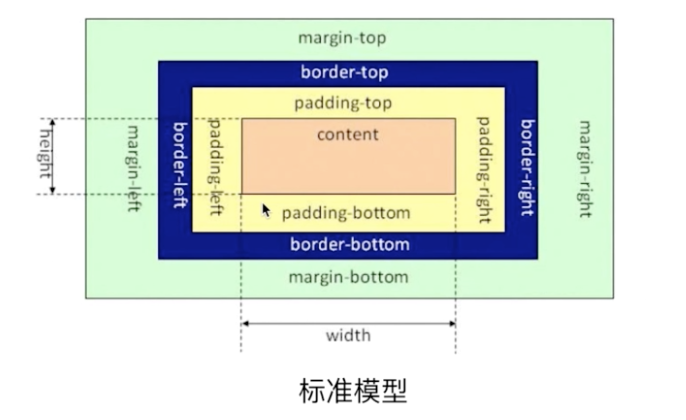
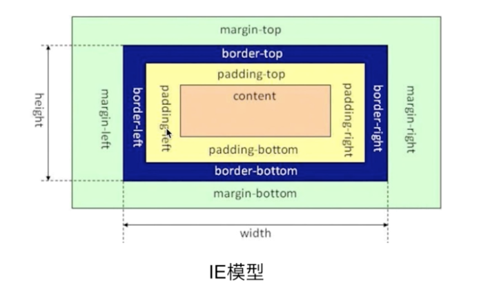

### CSS

#### 盒模型

`box-sizing: content-box;`

`box-sizing: border-box;`

#### CSS新特性，伪类，伪元素，锚伪类

#### CSS实现隐藏页面的方式

#### 如何实现水平居中和垂直居中

#### 说说position，display

#### 请解释*{box-sizing: border-box;}的作用，并说明使用它的好处

#### 浮动元素引起的问题和解决办法？绝对定位和相对定位，元素浮动后的display值

#### link和@import引入css的区别

#### 解释一下css3的flexbox，以及使用场景

#### inline和inline-block的却别

#### 哪些是块级元素哪些是行内元素，各有什么特点

#### grid布局

#### table布局的作用

#### flex布局

#### 实现两栏布局有哪些方法

#### CSS dpi

#### attribute和property的区别

#### css布局问题，css实现三列布局怎么做，如果要求中间宽度自适应怎么做

#### 流式布局如何实现，响应式布局如何实现

#### 移动端布局方案

#### 圣杯布局、双飞翼布局、flex布局

#### 清除浮动原理

#### overflow: hidden; 有什么缺点

#### padding百分比，是相对于父级宽度还是相对于自身宽度

#### CSS3动画，transition和animation区别，animation的属性，加速度和重力的模拟实现

#### CSS3如何实现旋转图片

#### Sass Less

#### 对移动端开发了解多少

#### 什么是BFC，如何创建BFC，解决什么问题

#### CSS中的度量单位（px,pt,rem,em,ex,vw,vh,vh,vmin,vmax）

#### CSS选择器优先级

#### 雪碧图

#### SVG

#### 媒体查询的原理

#### CSS加载时异步的吗？表现在什么地方

#### 常遇到的浏览器兼容问题有哪些，常用的hack技巧

#### 外边距合并

#### 解释一下`::before`和`:after`中双引号和单引号的区别

