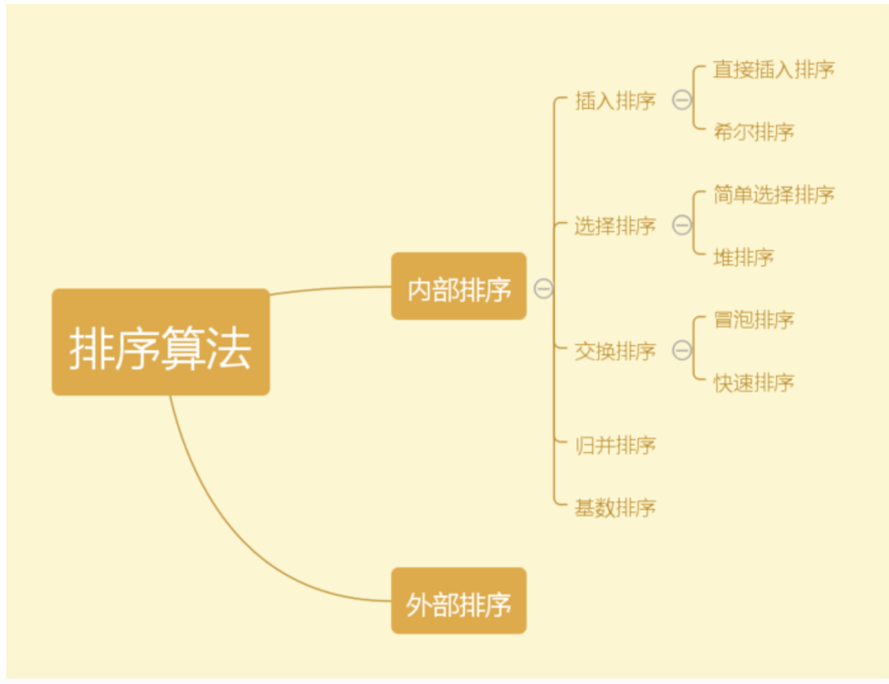
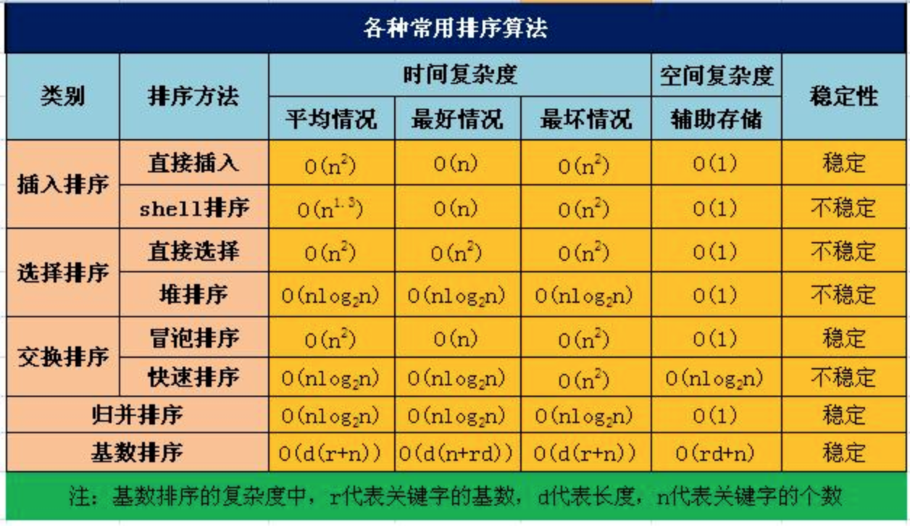

### 数据结构

#### 基本数据结构：（数组、队列、链表、堆、二叉树、哈希表等等）

推荐书籍《数据结构与算法JavaScript描述》：[《数据结构与算法JavaScript描述》练习题](https://github.com/jinmengjie/javascript-algorithms/tree/master/exercises)

#### 8种排序算法，原理，以及适用场景和复杂度





概念参考：[数据结构常见的八大排序算法（详细整理）](https://www.jianshu.com/p/7d037c332a9d)

实现参考：[部分排序算法的JavaScript实现](https://github.com/jinmengjie/javascript-algorithms/blob/master/notes/sortAlgorithms.md)

#### 说出越多越好的费波拉切数列的实现方法？

参考：[算法技巧: 如何使用JavaScript编写高效的fabonacci数列](https://www.jianshu.com/p/0b32ce736c24)

斐波那契数列：

> 0, 1, 1, 2, 3, 5, 8, 13, 21, 34, 55, 89, 144, 233, 377, 610, 987, ...

在数学上，斐波那契数列是以递归的方式定义：

- f(0) = 0

- f(1) = 1

- n >= 2时：f(n) = f(n - 1) + f(n - 2) 

实现一：

```javascript
function fabonacci(n) {
    if (n === 0) {
        return 0;
    }
    if (n === 1) {
        return 1;
    }
    return fabonacci(n - 1) + fabonacci(n - 2);
}
```
该实现太耗时，每次都要重复计算已经计算过的值。

实现二：

```javascript
var cache = {
    0: 0,
    1: 1
};

function fabonacci(n) {
    if (typeof cache[n] === 'number') { 
        return cache[n];
    }
    var result = cache[n] = fabonacci(n - 1) + fabonacci(n - 2);
    return result;
}
```
上面的是C语言的风格，cache放在外部，我们也可以编写函数式风格的fabonacci程序，有助于减少变量混乱

实现三：

```javascript
function fabonacci() {
    var cache = {
        0: 0,
        1: 1
    };
    return function __fabonacci(n) {
        return typeof cache[n] === 'number'
               ? cache[n]
               : cache[n] = __fabonacci(n - 1) + __fabonacci(n - 2);
    };
}

var fb = fabonacci();
fb(50);
```
cache的键都是数字，而且是从0开始递增计数，所以，cache也可以用数组代替

实现四：

```javascript
function fabonacci() {
    var cache = [0, 1];
    return function __fabonacci(n) {
        return typeof cache[n] === 'number'
               ? cache[n]
               : cache[n] = __fabonacci(n - 1) + __fabonacci(n - 2);
    };
}
```

实现五：面向对象方式

```javascript
function Fabonacci() {
    if (!(this instanceof Fabonacci)) {
        return new Fabonacci();
    }
    this._cache = [0, 1];
}
Fabonacci.prototype.compute = function (n) {
    return typeof this._cache[n] === 'number'
           ? this._cache[n]
           : this._cache[n] = this.compute(n - 1) + this.compute(n - 2);
};

Fabonacci().compute(50);
```


