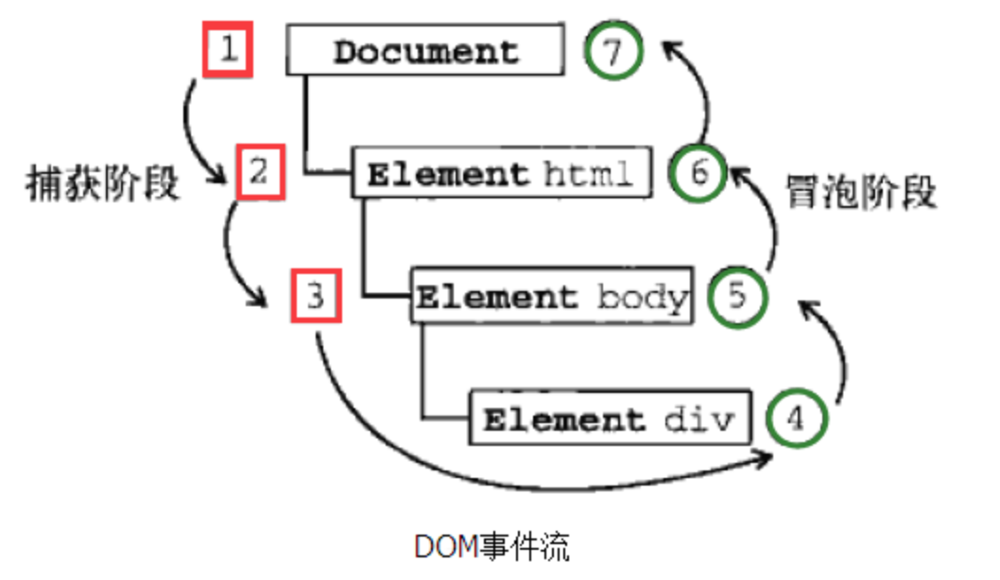

### JS

#### JS的基本数据类型有哪些？引用类型有哪些？null和undefined区别

- 基本数据类型（原始数据类型）

String\Number\Boolean\Symbol\Null\Undefined

- 引用数据类型

Object

[undefined与null的区别](http://www.ruanyifeng.com/blog/2014/03/undefined-vs-null)

```javascript
typeof undefined; //"undefined"
typeof null; //"object"

Number(null); //0
Number(undefined); //NaN
```

#### 类型判断

- typeof

- instanceof

- Object.prototype.toString.call()

#### Object是引用类型吗？引用类型和基本类型区别，哪个存在堆上面，哪个存在栈上面

Object是引用类型。

基本类型值指的是那些保存在栈内存中的简单数据段，即这种值完全保存在内存中的一个位置。

引用类型值则是指那些保存在堆内存中的对象，意思是变量中保存的实际上只是一个指针，这个指针指向内存中的另一个位置，该位置保存对象。

区别：

- 动态属性

对于引用类型的值，可以为其添加属性和方法，也可以改变和删除其属性和方法。

- 复制变量值

如果从一个变量向另一个变量复制基本类型的值，会在栈中创建一个新值，然后把该值复制到为新变量分配的位置上。

当一个变量向另一个变量复制引用类型的值时，同样也会将存储在栈中的值复制一份到为新变量分配的空间中。不同的是，这个值的副本实际上是一个指针，而这个指针指向存储在堆中的一个对象。复制后，两个变量实际上将引用同一个对象。因此改变其中一个变量，就会影响到另一个变量。

#### 常见的DOM操作API

[常用DOM API](https://www.cnblogs.com/Nutrient-rich/p/6959564.html)

- HTMLCollection

[HTMLCollection vs. NodeList](https://www.jianshu.com/p/f6ff5ebe45fd)

#### JavaScript的事件流模型都有什么

```html
<html>
    <head></head>
    <body>
        <div>Click Me</div>
    </body>
</html>
```

在冒泡型事件流中click事件传播顺序为：div -> body -> html -> document

在捕获型事件流中click事件传播顺序为：document -> html -> body -> div



#### 事件委托，事件冒泡和事件捕获，如何阻止事件冒泡，如何阻止默认事件

[JS事件模型](https://segmentfault.com/a/1190000006934031)

- DOM事件模型中的事件对象常用属性:

1、type用于获取事件类型

2、target获取事件目标

3、stopPropagation()阻止事件冒泡

4、preventDefault()阻止事件默认行为

- IE事件模型中的事件对象常用属性:

1、type用于获取事件类型

2、srcElement获取事件目标

3、cancelBubble阻止事件冒泡

4、returnValue阻止事件默认行为

#### 闭包概念，如何实现闭包，闭包优缺点

[学习Javascript闭包（Closure）](http://www.ruanyifeng.com/blog/2009/08/learning_javascript_closures.html)

#### this有哪些使用场景，跟C、Java中的this有什么区别？如何改变this

- this的使用场景

[Javascript的this用法](http://www.ruanyifeng.com/blog/2010/04/using_this_keyword_in_javascript.html)

- 跟C、Java中的this有什么区别

[java中this用法和javascript中的this用法](https://blog.csdn.net/zhutiandashen/article/details/56018146?locationNum=10&fps=1)

- 如何改变this

call、apply、bind

#### call、apply、bind

call、bind、apply这三个函数的第一个参数都是this的指向对象，第二个参数差别就来了：

call的参数是直接放进去的，第二第三第n个参数全都用逗号分隔，直接放到后面`obj.myFun.call(db,'成都', ... ,'string' )`；

apply的所有参数都必须放在一个数组里面传进去`obj.myFun.apply(db,['成都', ..., 'string' ])`;

bind方法返回的是一个修改过后的函数。它的参数和call一样。
　　　　
三者的参数不限定是string类型，允许是各种类型，包括函数、object等

```javascript
if (Function.prototype.bind === undefined) {
    Function.prototype.bind = function(obj/*，参数列表*/){
        var fun=this;//留住this
        //*****将类数组对象，转化为普通数组
        var args=Array.prototype.slice.call(arguments,1);

        return function(){
            //将后传入的参数值，转为普通数组      
            var innerArgs=Array.prototype.slice.call(arguments);//将之前绑定的参数值和新传入的参数值，拼接为完整参数之列表
            var allArgs=args.concat(innerArgs)
            //调用原始函数fun，替换this为obj，传入所有参数
            fun.apply(obj,allArgs);
        }
    }
}
```

#### attribute和property区别

property：属性，attribute：特性

property是DOM中的属性，是JavaScript里的对象；

attribute是HTML标签上的特性，它的值只能够是字符串；

DOM有其默认的基本属性，而这些属性就是所谓的“property”，无论如何，它们都会在初始化的时候再DOM对象上创建。如果在TAG对这些属性进行赋值，那么这些值就会作为初始值赋给DOM的同名property。

HTML标签中定义的属性和值会保存该DOM对象的attributes属性里面；这些attribute属性的JavaScript中的类型是Attr，而不仅仅是保存属性名和值这么简单；

##### 创建

- DOM对象初始化时会在创建默认的基本property；
- 只有在HTML标签中定义的attribute才会被保存在property的attributes属性中；
- attribute会初始化property中的同名属性，但自定义的attribute不会出现在property中；
- attribute的值都是字符串；

##### 数据绑定

- attributes的数据会同步到property上，然而property的更改不会改变attribute；

- 对于value，class这样的属性/特性，数据绑定的方向是单向的，attribute->property；

- 对于id而言，数据绑定是双向的，attribute<=>property；

- 对于disabled而言，property上的disabled为false时，attribute上的disabled必定会并存在，此时数据绑定可以认为是双向的；

- href是特殊的属性/特性，二者是双向绑定的，更改任意一方，都会导致另一方的的值发生改变。而且，这并不是简单的双向绑定，property中的href永远保存绝对路径，而attribute中的href则是保存相对路径。

##### 使用

- 可以使用DOM的setAttribute方法来同时更改attribute；

- 直接访问attributes上的值会得到一个Attr对象，而通过getAttribute方法访问则会直接得到attribute的值；

- 大多数情况（除非有浏览器兼容性问题），jQuery.attr是通过setAttribute实现，而jQuery.prop则会直接访问DOM对象的property；

#### 显式原型和隐式原型，手绘原型链，原型链是什么？为什么要有原型链

显式原型：`prototype`

隐式原型：`__proto__`

注意：通过Function.prototype.bind方法构造出来的函数没有`prototype`属性。

注意：Object.prototype.这个对象的是个例外，它的`__proto__`值为null。


为什么要有原型链：实现继承

#### 创建对象的多种方式

- 字面量

- new

- Object.create()

#### 实现继承的多种方式，优缺点

#### new 一个对象具体做了什么

1、创建一个新对象
2、将构造函数的作用域赋给新对象（this指向这个新对象）
3、执行构造函数中的代码（为这个新对象添加属性）
4、返回新对象

`如果构造函数有return一个对象，直接返回return的内容，否则返回创建的这个对象`

```javascript
    function New (f) {
/*1*/  var n = { '__proto__': f.prototype };
       return function () {
/*2、3*/    f.apply(n, arguments);
/*4*/    return n;
       };
    }
```

#### 手写Ajax，XMLHttpRequest

#### 变量提升

#### 举例说明匿名函数的典型用例

#### 指出JS宿主对象和原生对象的却别，为什么扩展JS内置对象不是好的做法？有哪些内置对象和内置函数

- 本地对象 

Object、Function、Array、String、Boolean、Number、Date、RegExp、Error、EvalError、RangeError、ReferenceError、SyntaxError、TypeError、URIError

- 内置对象 

Global、Math

- 宿主对象 

BOM、DOM

- 为什么扩展JS内置对象不是好的做法

如果哪一天浏览器或javascript本身实现这个方法，而且和你扩展的实现有不一致的表现，会造成冲突

- 内置函数

[js常用内置函数](https://blog.csdn.net/u012169411/article/details/11818997)

#### document load和document DOMContentLoaded两个事件的区别

[load和DOMContenLoaded的区别](https://www.cnblogs.com/yonglin/p/7834065.html)

当 onload 事件触发时，页面上所有的DOM，样式表，脚本，图片，flash都已经加载完成了。

当 DOMContentLoaded 事件触发时，仅当DOM加载完成，不包括样式表，图片，flash。

#### === 和 ==

[Javascript 中 == 和 === 区别是什么？](https://www.zhihu.com/question/31442029)

```javascript
[] === []; // false
undefined === undefined; // true
[] == []; // false
undefined == undefined; // true
```

#### typeof能够得到哪些值

[typeof-MDN](https://developer.mozilla.org/zh-CN/docs/Web/JavaScript/Reference/Operators/typeof)


#### 什么是`use strict`，好处和坏处

[Javascript 严格模式(“use strict”)详解](http://www.webhek.com/post/javascript-use-strict-mode.html)

#### 函数的作用域是什么？JS的作用域有哪几种？

#### JS如何实现重载和多态

#### 常用的数组API及字符串API

- Array API

[Array - MDN](https://developer.mozilla.org/zh-CN/docs/Web/JavaScript/Reference/Global_Objects/Array)

1、Array.prototype.splice() 方法通过删除现有元素和/或添加新元素来更改一个数组的内容。

```javascript
    var myFish = ['angel', 'clown', 'mandarin', 'sturgeon'];

    myFish.splice(2, 0, 'drum'); // 在索引为2的位置插入'drum'
    // myFish 变为 ["angel", "clown", "drum", "mandarin", "sturgeon"]

    myFish.splice(2, 1); // 从索引为2的位置删除一项（也就是'drum'这一项）
    // myFish 变为 ["angel", "clown", "mandarin", "sturgeon"]

    var arr = [1, 2, 3];
    arr.splice(1, 0, 'a', 'b', 'c');
    // arr: [1, "a", "b", "c", 2, 3]
    arr.splice(1, 2, 'e', 'f', 'g');
    // arr: [1, "e", "f", "g", "c", 2, 3]
```

2、Array.prototype.reduce() 方法对累加器和数组中的每个元素（从左到右）应用一个函数，将其减少为单个值。

```javascript
    const array1 = [1, 2, 3, 4];
    const reducer = (accumulator, currentValue) => accumulator + currentValue;

    // 1 + 2 + 3 + 4
    console.log(array1.reduce(reducer));
    // expected output: 10

    // 5 + 1 + 2 + 3 + 4
    console.log(array1.reduce(reducer, 5));
    // expected output: 15
```

arr.reduce(callback[, initialValue])

参数： 

callback: 执行数组中每个值的函数，包含四个参数：

    accumulator: 累加器累加回调的返回值; 它是上一次调用回调时返回的累积值，或initialValue（如下所示）。

    currentValue: 数组中正在处理的元素。

    currentIndex | 可选: 数组中正在处理的当前元素的索引。 如果提供了initialValue，则索引号为0，否则为索引为1。

    array | 可选: 调用reduce的数组

initialValue | 可选: 用作第一个调用 callback的第一个参数的值。 如果没有提供初始值，则将使用数组中的第一个元素。 在没有初始值的空数组上调用 reduce 将报错。

返回值：函数累计处理的结果

#### 原生事件绑定（跨浏览器），DOM0和DOM2的区别

#### 给定一个元素，获取它相对于视图窗口的坐标

#### 如何实现图片滚动懒加载

#### JS的字符串类型有哪些方法？正则表达式的函数怎么使用

#### 深拷贝，浅拷贝

#### 编写一个通用的事件监听函数 

#### WEB端cookie的设置和获取

#### setTimeout和Promise的执行顺序

#### microtask和macrotask

#### navigator对象，location和history

#### JS的垃圾回收机制

#### 内存泄漏的原因和场景

#### DOM事件的绑定有几种方式

#### DOM事件中的target和currentTarget的区别

#### typeof和instanceof的区别，instanceof的原理

#### JS动画和CSS3动画比较

#### JavaScript倒计时（setTimeout）

#### JS处理异常

#### JS的设计模式

#### 轮播图的实现，以及轮播图组件开发，轮播10000张图片过程

#### websocket的工作原理和机制

#### 手指点击可以触控的屏幕时，是什么事件

#### 什么是函数柯里化？以及说一下JS的API有哪些应用到了函数柯里化的实现？

(函数柯里化一些了解，以及在函数式编程的应用，最后说了一下JS中bind函数和数组的reduce方法用到了函数柯里化。)

#### JS代码调试


